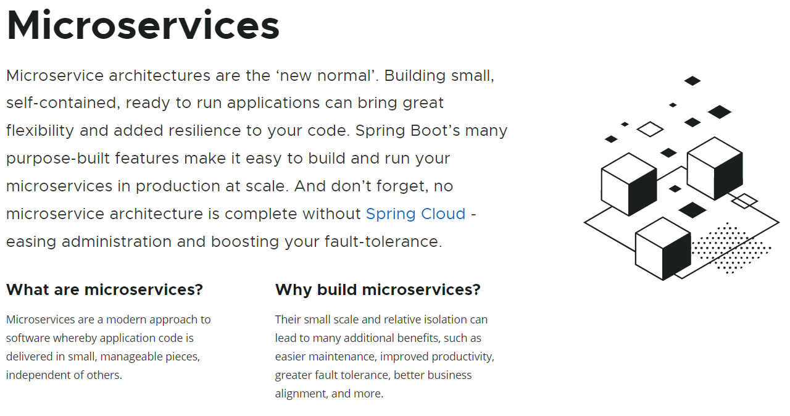

# 마이크로서비스 이해하기



### 모놀리식 vs 마이크로서비스 아키텍처


- 모놀리식 아키텍처는 `scale out` 이 불가능

### Microservice Communication


- `spring-cloud-starter-netflix-eureka-server`
- `spring-cloud-starter-netflix-eureka-client`

### eureka server

```java
// server
@EnableEurekaServer
public class EurekaServerApplication {
    public static void main(String[] args) {
        SpringApplication.run(EurekaServerApplication.class, args);
    }
}
```

### eureka client

```java

@EnableEurekaClient
@SpringBootApplication
public class CustomerApplication {
    public static void main(String[] args) {
        SpringApplication.run(CustomerApplication.class, args);
    }
}
```

```yaml
spring: 
	eureka:
	  client:
	    service-url:
	      defaultZone: http://localhost:8761/eureka
	    fetch-registry: true
	    register-with-eureka: true
	    enabled: true (default)
```

### eureka dashboard


- `@LoadBalanced`


```java
//fraud.fraudController
@RestController
@RequestMapping("api/v1/fraud-check")
@AllArgsConstructor
@Slf4j
public class FraudController {
    private final FraudCheckService fraudCheckService;

    @GetMapping(path = "{customerId}")
    public FraudCheckResponse isFraudster(@PathVariable("customerId") Integer customerId) {
        boolean isFraudulentCustomer = fraudCheckService
                .isFraudulentCustomer(customerId);
        log.info("fraud check request for customer {}", customerId);
        return new FraudCheckResponse(isFraudulentCustomer);
    }
}

//clients.FraudClient 
@FeignClient("fraud") 
public interface FraudClient {

    @GetMapping(path = "api/v1/fraud-check/{customerId}")
    FraudCheckResponse isFraudster(@PathVariable("customerId") Integer customerId);
}

// customer.CustomerService
@Service
@AllArgsConstructor
public class CustomerService {
    private final FraudClient fraudClient;

    public void registerCustomer(CustomerRegistrationRequest request) {
        Customer customer = Customer.builder()
                .firstName(request.firstName())
                .lastName(request.lastName())
                .email(request.email())
                .build();

        customerRepository.saveAndFlush(customer);

//        as-is
//        FraudCheckResponse fraudCheckResponse = restTemplate.getForObject(
//                //"http://localhost:8081/api/v1/fraud-check/{customerId}",
//                "http://FRAUD:8081/api/v1/fraud-check/{customerId}",
//                FraudCheckResponse.class,
//                customer.getId()
//        );

        // to-be
        FraudCheckResponse fraudCheckResponse = fraudClient.isFraudster(customer.getId());

        if (fraudCheckResponse.isFraudster()) {
            throw new IllegalStateException("fraudster");
        }
    }

}
```

- 서비스를 찾는 방법은 `[spring.application.name](http://spring.application.name)` 이다

## Distributed Tracing


- `span` : 작업의 기본 단위
- `trace` : `span` 범위의 집합


### API Gateway


```yaml
spring:
  application:
    name : api-gateway
  cloud:
    gateway:
      routes:
        - id: customer
          uri: lb://CUSTOMER
          predicates:
            - Path=/api/v1/customers/**
```

### Message Queue

- `synchronous` 문제를 해결한다


- `topic`
- `queue`
- `binding`

```java
//producer
public void registerCustomer(CustomerRegistrationRequest request) {
	rabbitMQMessageProducer.publish(
                notificationRequest,  //payload
                "internal.exchange",  // exchange
                "internal.notification.routing-key"  //routing ke
        );
}

//consumer
@RabbitListener(queues = "${rabbitmq.queue.notification}")
    public void consumer(NotificationRequest request) {
        log.info("Consumed {} from queue", request);
        notificationService.send(request);
    }
```

### k8s


- `load balancer`
- `auto scaling`
- `zero time/downtown`


### references

#### docker
 - [https://hub.docker.com/_/eclipse-temurin/](https://hub.docker.com/_/eclipse-temurin/)
   - [https://cloud.google.com/container-registry?hl=ko](https://cloud.google.com/container-registry?hl=ko)
   - [https://github.com/features/packages](https://github.com/features/packages)
   - [https://aws.amazon.com/ko/ecr/](https://aws.amazon.com/ko/ecr/)
   
#### spring cloud
 - [https://spring.io/projects/spring-cloud-openfeign](https://spring.io/projects/spring-cloud-openfeign)
 - [https://spring.io/projects/spring-cloud-gateway](https://spring.io/projects/spring-cloud-gateway)
 - [https://spring.io/projects/spring-cloud-sleuth](https://spring.io/projects/spring-cloud-sleuth)

#### message queue
 - [https://www.rabbitmq.com/](https://www.rabbitmq.com/)
   - [https://www.rabbitmq.com/tutorials/amqp-concepts.html](https://www.rabbitmq.com/tutorials/amqp-concepts.html)
 - [https://kafka.apache.org/](https://kafka.apache.org/)
 - [https://aws.amazon.com/ko/sqs/](https://aws.amazon.com/ko/sqs/)

#### kubernetes
 - [https://kubernetes.io/ko/](https://kubernetes.io/ko/)
 - [https://minikube.sigs.k8s.io/docs/start/](https://minikube.sigs.k8s.io/docs/start/)
 - [https://github.com/features/packages](https://github.com/features/packages)
